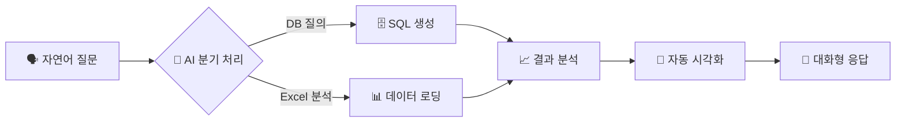
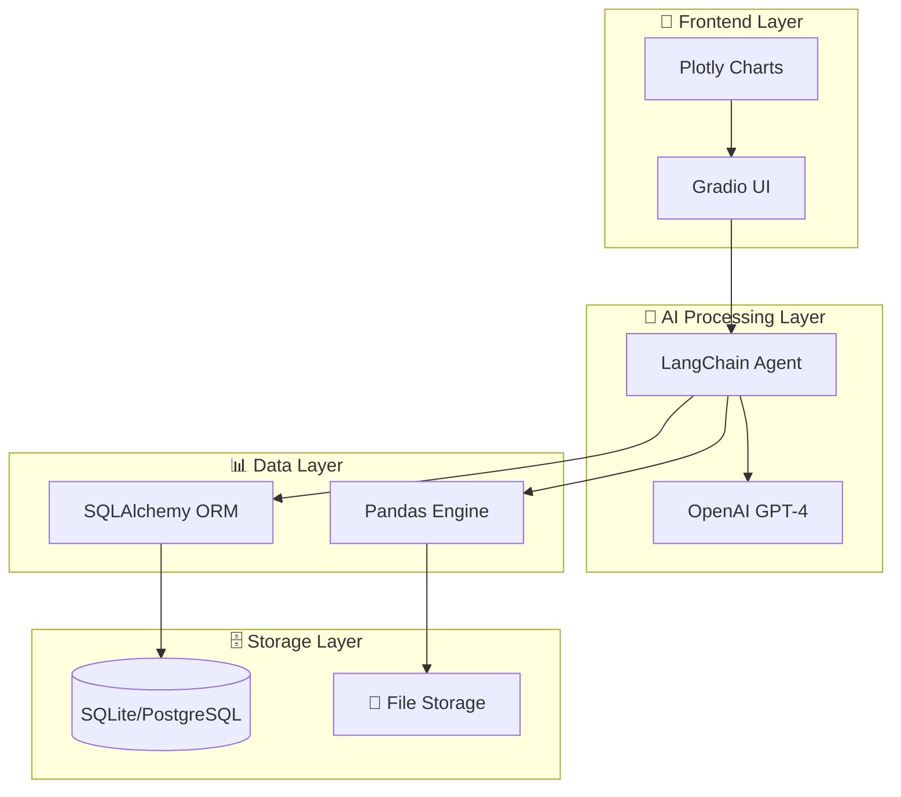
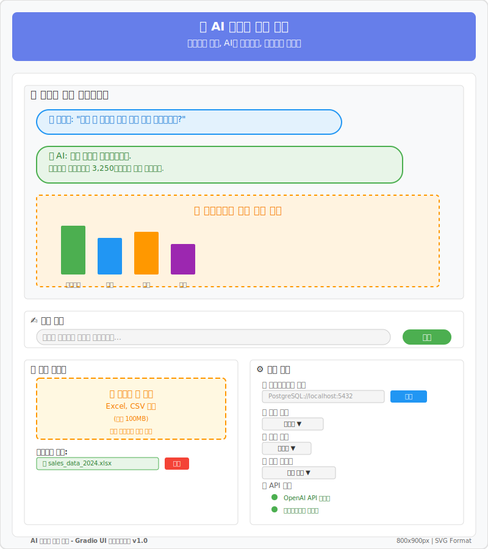
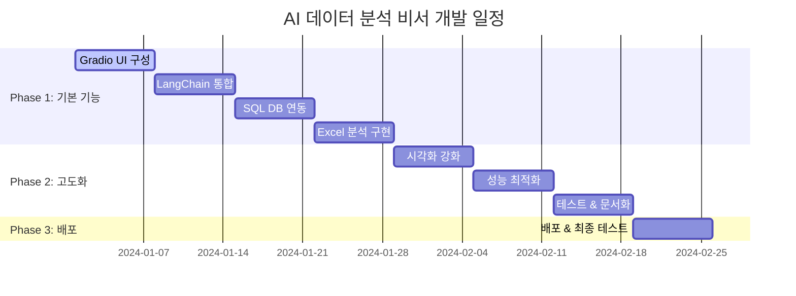

<div align="center">

# 🤖 AI 데이터 분석 비서
## *LLM 기반 데이터 질의·분석·시각화 서비스*


---

*"자연어로 묻고, AI가 분석하고, 시각화로 답하다"*

</div>

## 🎯 **프로젝트 비전**

> **모든 사람이 데이터 전문가가 될 수 있는 세상**  
> 복잡한 SQL이나 분석 도구 없이, 일상 언어만으로 데이터의 숨겨진 인사이트를 발견할 수 있는 AI 분석 비서

### 💎 **핵심 가치**

<table>
<tr>
<td align="center" width="25%">

<br><strong>자연어 기반</strong>
<br><small>SQL 없이 일상 언어로</small>
</td>
<td align="center" width="25%">

<br><strong>즉시 분석</strong>
<br><small>5초 내 결과 제공</small>
</td>
<td align="center" width="25%">

<br><strong>자동 시각화</strong>
<br><small>최적 차트 자동 생성</small>
</td>
<td align="center" width="25%">

<br><strong>대화형 UI</strong>
<br><small>연속 질문으로 심화 분석</small>
</td>
</tr>
</table>

---

## 👥 **타겟 사용자**

<div align="center">

### 🎯 **주요 사용자 그룹**

</div>

<table>
<tr>
<td width="50%">

#### 📊 **비즈니스 전문가**
- **비즈니스 분석가** - 데이터 인사이트 발굴
- **마케팅 담당자** - 캠페인 성과 분석  
- **중소기업 경영진** - 빠른 의사결정 지원

</td>
<td width="50%">

#### 🎓 **학습자 & 연구자**
- **대학생** - 데이터 분석 학습
- **연구자** - 연구 데이터 탐색
- **개발자** - 프로토타이핑 도구

</td>
</tr>
</table>

---

### 🧑‍💼 **핵심 페르소나**

<div style="background: linear-gradient(135deg, #667eea 0%, #764ba2 100%); padding: 20px; border-radius: 10px; color: white; margin: 20px 0;">

**👤 김분석 (마케팅 팀장, 35세)**

📋 **배경**
- SQL 기초 지식 보유, 복잡한 쿼리 작성 어려움
- 월간 매출 트렌드, 고객 세그먼트 분석 담당
- 경영진 보고용 시각화 자료 제작 필요

💬 **대표 질문**
> *"이번 달 신규 고객 중 재구매율이 높은 연령대는?"*  
> *"지난 분기 대비 매출 증가율이 높은 제품군은?"*

🎯 **니즈**
- 빠른 분석 결과 | 직관적인 시각화 | 경영진 설득력 있는 자료

</div>

---

## 🚀 **핵심 기능**

<div align="center">

### ⚡ **AI 분석 워크플로우**



</div>

---

### 🎯 **주요 기능 모듈**

<table>
<tr>
<td width="50%" style="vertical-align: top;">

#### 🧠 **1. 자연어 질의 엔진**

```python
# 예시 워크플로우
입력: "지난 3개월 매출이 가장 높은 제품 카테고리는?"
     ↓
🤖 LangChain 분석
     ↓  
📝 SQL 자동 생성
     ↓
🗄️ 안전한 DB 조회
     ↓
📊 결과 + 차트 + 인사이트
```

**✨ 특징**
- 한국어 자연어 처리 최적화
- 컨텍스트 기반 질의 이해
- 다단계 질문 지원

</td>
<td width="50%" style="vertical-align: top;">

#### 🔀 **2. 지능형 분기 처리**

**🎯 자동 감지 시스템**
- **DB 질의** → `매출`, `고객`, `주문` 등 키워드
- **Excel 분석** → 파일 업로드 감지
- **혼합 분석** → DB + Excel 데이터 결합

**🚀 처리 속도**
- 질의 분류: `< 1초`
- SQL 생성: `< 2초`  
- 결과 출력: `< 5초`

</td>
</tr>
</table>

---

### 🗄️ **데이터 소스 지원**

<div style="display: flex; justify-content: space-around; margin: 20px 0;">

<div style="text-align: center; padding: 15px; border: 2px solid #4CAF50; border-radius: 10px; width: 45%;">

#### 📊 **SQL 데이터베이스**
- **SQLite** - 로컬 개발용
- **PostgreSQL** - 프로덕션 환경  
- **MySQL** - 레거시 시스템

🔒 **보안 특징**
- 읽기 전용 접근
- SQL Injection 방지
- 자동 스키마 인식

</div>

<div style="text-align: center; padding: 15px; border: 2px solid #FF9800; border-radius: 10px; width: 45%;">

#### 📁 **파일 데이터**
- **Excel** - `.xlsx`, `.xls`
- **CSV** - 구분자 자동 감지
- **최대 100MB** 파일 지원

🎯 **분석 기능**
- 자동 데이터 타입 인식
- 기술통계 + 상관관계
- 트렌드 패턴 분석

</div>

</div>

---

### 🎨 **자동 시각화 엔진**

<table style="width: 100%; border-collapse: collapse;">
<tr style="background: #f8f9fa;">
<th width="20%">📊 차트 타입</th>
<th width="30%">🎯 최적 사용 사례</th>
<th width="25%">📈 데이터 특성</th>
<th width="25%">🔧 기술 스택</th>
</tr>
<tr>
<td><strong>막대 차트</strong></td>
<td>카테고리별 비교 분석</td>
<td>범주형 + 수치형</td>
<td rowspan="5" style="vertical-align: middle; text-align: center;"><strong>Plotly</strong><br>인터랙티브<br>확대/축소<br>필터링<br>내보내기</td>
</tr>
<tr>
<td><strong>선 차트</strong></td>
<td>시계열 트렌드 분석</td>
<td>시간 + 수치형</td>
</tr>
<tr>
<td><strong>파이 차트</strong></td>
<td>구성 비율 분석</td>
<td>범주형 비율</td>
</tr>
<tr>
<td><strong>산점도</strong></td>
<td>상관관계 분석</td>
<td>수치형 + 수치형</td>
</tr>
<tr>
<td><strong>히트맵</strong></td>
<td>패턴 및 밀도 분석</td>
<td>다차원 수치형</td>
</tr>
</table>

---

## 🛠️ **기술 아키텍처**

<div align="center">

### 🏗️ **시스템 아키텍처**



</div>

---

### 🎯 **기술 스택 상세**

| 레이어 | 핵심 기술 | 주요 기능 |
|--------|-----------|-----------|
| **🎨 Frontend** | **Gradio 4.0+** | • 빠른 프로토타이핑<br>• 내장 채팅 UI<br>• 자동 API 생성 |
| | **Plotly** | • 인터랙티브 차트<br>• 20+ 차트 타입<br>• 웹 최적화 |
| **🧠 AI Engine** | **LangChain** | • SQL Chain<br>• Agent Framework<br>• 메모리 관리 |
| | **OpenAI GPT-4** | • 자연어 이해<br>• SQL 생성<br>• 결과 해석 |
| **📊 Data Engine** | **Pandas 2.0+** | • 데이터 처리<br>• 통계 분석<br>• 파일 I/O |
| | **SQLAlchemy** | • ORM 매핑<br>• 연결 풀링<br>• 쿼리 최적화 |
| **🗄️ Storage** | **SQLite/PostgreSQL** | • 트랜잭션 지원<br>• 인덱스 최적화<br>• 백업/복구 |
| | **File System** | • 임시 파일 관리<br>• 자동 정리<br>• 보안 검증 |

---

### 🚀 **배포 전략**

| 단계 | 플랫폼 | 비용 | 주요 특징 | 목표 |
|------|--------|------|-----------|------|
| **🌟 Phase 1: 프로토타입** | Gradio Cloud | 무료 ~ $20/월 | • 원클릭 배포<br>• 자동 HTTPS<br>• 공유 링크 생성 | 빠른 MVP 검증 |
| **🏢 Phase 2: 프로덕션** | Docker + Cloud | $100-200/월 | • 컨테이너화<br>• 로드 밸런싱<br>• 모니터링 | 확장 가능한 서비스 |

---

## 📱 **사용자 인터페이스**

<div align="center">

### 🎨 **Gradio UI 디자인**

</div>

### 🎨 **Gradio UI 와이어프레임**

<div align="center">

**📁 상세 와이어프레임 파일**: [`gradio_ui_wireframe.svg`](./gradio_ui_wireframe.svg)  
**📋 구현 가이드**: [`wireframe_guide.md`](./wireframe_guide.md)



</div>

### 📋 **UI 구성 요소 설명**

| 구성 요소 | 위치 | 기능 설명 |
|-----------|------|-----------|
| **🤖 헤더** | 상단 | 브랜딩, 서비스 소개 문구 |
| **💬 채팅 영역** | 중앙 상단 | 대화 히스토리, AI 응답, 차트 표시 |
| **✍️ 입력 영역** | 중앙 하단 | 자연어 질문 입력 및 전송 버튼 |
| **📁 업로드 패널** | 좌측 하단 | 파일 드래그앤드롭, 업로드된 파일 관리 |
| **⚙️ 설정 패널** | 우측 하단 | DB 연결, 언어, 테마, API 상태 |

---

### 🔄 **사용자 경험 플로우**

| 단계 | 기능 | 세부 사항 |
|------|------|-----------|
| **1️⃣ 질문 입력** | 🗣️ **자연어 질문** | • 음성 입력 지원<br>• 예시 질문 제공<br>• 자동 완성 기능 |
| **2️⃣ AI 처리** | 🤖 **지능형 분석** | • 실시간 진행 표시<br>• 처리 단계 안내<br>• 예상 소요 시간 |
| **3️⃣ 결과 제공** | 📊 **시각화 결과** | • 텍스트 + 표 + 차트<br>• 인터랙티브 조작<br>• 결과 내보내기 |

---

## 🔄 사용자 플로우

### 시나리오 1: DB 질의
1. **질문 입력**: "2023년 월별 매출 추이를 보여줘"
2. **의도 파악**: LangChain이 DB 질의로 분류
3. **SQL 생성**: 자연어를 SQL 쿼리로 변환
4. **DB 조회**: 안전한 쿼리 실행
5. **결과 분석**: 데이터 패턴 분석 및 인사이트 도출
6. **시각화**: 선 차트로 트렌드 표시
7. **응답 제공**: 텍스트 설명 + 표 + 차트

### 시나리오 2: Excel 분석
1. **파일 업로드**: Excel 파일 드래그 앤 드롭
2. **질문 입력**: "어떤 지역의 매출이 가장 높아?"
3. **데이터 로딩**: Pandas로 파일 읽기
4. **분석 수행**: 지역별 매출 집계
5. **시각화**: 막대 차트 생성
6. **응답 제공**: 분석 결과 + 차트

---

## 📊 성공 지표 (KPI)

### 사용성 지표
- **응답 시간**: 평균 5초 이내 결과 제공
- **정확도**: SQL 쿼리 생성 정확도 90% 이상
- **사용자 만족도**: 4.5/5.0 이상

### 기술적 지표
- **시스템 가용성**: 99% 이상
- **동시 사용자**: 최대 50명 지원
- **파일 크기**: 최대 100MB Excel 파일 처리

---

## 🛡️ 보안 및 제약사항

### 보안 요구사항
- **SQL Injection 방지**: 파라미터화된 쿼리만 사용
- **읽기 전용 접근**: DB 수정 권한 없음
- **파일 검증**: 업로드 파일 형식 및 크기 제한
- **데이터 프라이버시**: 업로드된 파일 임시 저장 후 자동 삭제

### 기술적 제약사항
- **메모리 제한**: 대용량 데이터셋 처리 제한
- **LLM 비용**: API 호출 비용 관리 필요
- **네트워크 의존성**: 인터넷 연결 필수

---

## 📅 **개발 로드맵**

<div align="center">

### 🗓️ **8주 완성 계획**

</div>



---

### 🎯 **단계별 상세 계획**

| 단계 | 기간 | 주요 작업 | 산출물 |
|------|------|-----------|--------|
| **🟢 Phase 1: 기본 기능** | **4주** | | |
| | **Week 1** | • Gradio UI 기본 구성<br>• 채팅 인터페이스 구현 | ✅ 기본 UI 프로토타입 |
| | **Week 2** | • LangChain Agent 구성<br>• OpenAI API 연동 | ✅ 자연어 처리 엔진 |
| | **Week 3** | • SQLAlchemy ORM 설정<br>• 안전한 쿼리 실행 | ✅ DB 연동 모듈 |
| | **Week 4** | • Pandas 데이터 처리<br>• 파일 업로드 기능 | ✅ Excel 분석 엔진 |
| **🔵 Phase 2: 고도화** | **3주** | | |
| | **Week 5** | • Plotly 차트 구현<br>• 자동 시각화 로직 | ✅ 시각화 엔진 |
| | **Week 6** | • 성능 최적화<br>• 에러 핸들링 강화 | ✅ 안정성 개선 |
| | **Week 7** | • 단위/통합 테스트<br>• 사용자 가이드 작성 | ✅ 테스트 완료 |
| **🟡 Phase 3: 배포** | **1주** | | |
| | **Week 8** | • Gradio Cloud 배포<br>• 최종 사용자 테스트 | 🚀 **MVP 런칭** |

---

### 🎯 **주요 마일스톤**

| 마일스톤 | 시기 | 목표 |
|----------|------|------|
| **🏁 첫 질의 성공** | Week 2 | 기본 자연어 처리 완료 |
| **📊 Excel 분석 완료** | Week 4 | 파일 분석 기능 구현 |
| **📈 시각화 완성** | Week 6 | 차트 생성 엔진 완료 |
| **🚀 서비스 런칭** | Week 8 | MVP 배포 및 테스트 |

---

## 🎯 향후 확장 계획

### 단기 (3개월)
- **다국어 지원**: 영어 질의 처리
- **더 많은 차트**: 워드클라우드, 네트워크 그래프
- **데이터 내보내기**: PDF, PNG 결과 다운로드

### 중기 (6개월)
- **API 연동**: REST API, GraphQL 지원
- **실시간 데이터**: 스트리밍 데이터 분석
- **협업 기능**: 분석 결과 공유 및 댓글

### 장기 (1년)
- **Next.js 마이그레이션**: 더 복잡한 UI/UX
- **머신러닝**: 예측 분석 및 이상 탐지
- **엔터프라이즈**: 사용자 권한 관리, SSO

---

## 💰 예산 및 리소스

### 개발 리소스
- **개발자**: 1명 (풀스택)
- **개발 기간**: 8주
- **기술 스택**: Python, Gradio, LangChain

### 운영 비용 (월간)
- **OpenAI API**: $50-100
- **Gradio Cloud**: $20
- **데이터베이스**: $30 (PostgreSQL)
- **총 예상 비용**: $100-150/월

---

## ✅ 성공 기준

### 최소 기능 (MVP)
- ✅ 자연어로 DB 질의 가능
- ✅ Excel 파일 업로드 및 분석
- ✅ 기본 차트 생성 (막대, 선, 파이)
- ✅ Gradio 기반 대화형 인터페이스

### 성공 지표
- **기능적**: 90% 이상의 일반적인 질의 처리 성공
- **성능적**: 5초 이내 응답 시간
- **사용성**: 비개발자도 쉽게 사용 가능한 인터페이스

---

## 🚨 위험 요소 및 대응 방안

### 주요 위험
1. **LLM API 비용 초과**
   - 대응: 쿼리 캐싱, 사용량 모니터링
2. **부정확한 SQL 생성**
   - 대응: 검증 로직 추가, 사용자 피드백 수집
3. **대용량 데이터 처리 실패**
   - 대응: 파일 크기 제한, 샘플링 기능

### 기술적 도전
- **자연어 이해 정확도**: 다양한 질문 패턴 학습 필요
- **시각화 자동 선택**: 데이터 특성에 맞는 차트 선택 로직
- **성능 최적화**: 대용량 데이터 처리 시 메모리 관리

---

---

<div align="center" style="background: linear-gradient(135deg, #667eea 0%, #764ba2 100%); padding: 30px; border-radius: 15px; color: white; margin: 30px 0;">

## 🎯 **프로젝트 성공을 위한 핵심 전략**

### 💡 **"빠르게 만들고, 빠르게 검증하고, 빠르게 개선하라"**

**🚀 Gradio 기반 8주 MVP 완성 로드맵**  
*프로토타이핑 → 검증 → 확장의 단계적 접근*

---

### 📞 **문의 및 협업**

**📧 이메일**: [프로젝트 담당자 이메일]  
**💬 슬랙**: #ai-data-analysis-project  
**📋 프로젝트 보드**: [GitHub/Notion 링크]

</div>

---

<div align="center">

*"데이터의 힘을 모든 사람에게"* 🌟

**© 2024 AI 데이터 분석 비서 프로젝트**

</div>
